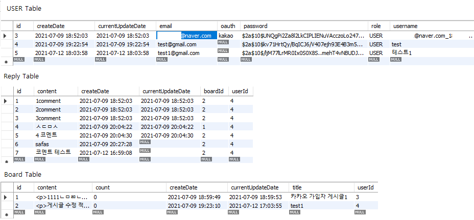
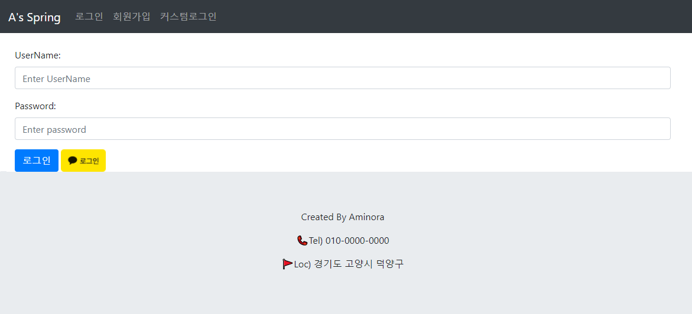
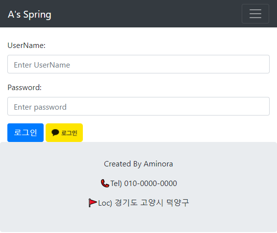
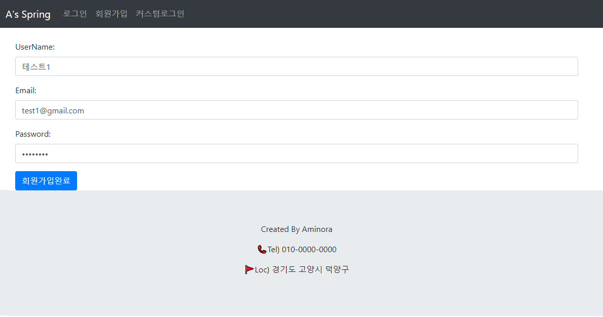
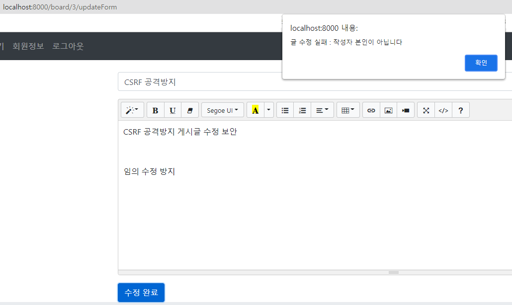
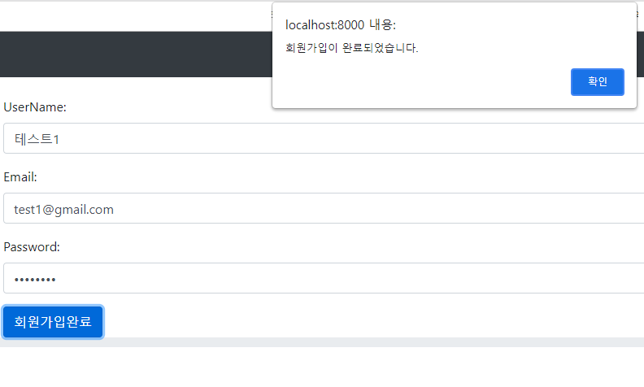

[Spring 프레임워크]  블로그 만들기(DB연동)
======================

# 1. 프로젝트 목표
## 1.1. 기능 구현
### 1.2.1. 회원가입 / 로그인 기능
	1. 회원정보 입력시 회원가입 및 자동 로그인 구현 
	2. 입력된 정보는 MySQL(InnoDB)에 자동으로 저장되게 연동
	3. 카카오 OAuth 기능을 활용한 로그인 기능 추가(자동 회원가입)
	4. Authentication의 로그인 세션 토큰을 활용한 사용자 확인
	5. 게시글 별도 관리 및 CSRF공격 방지

### 1.2.2. 게시글 작성 / 수정 / 삭제 기능 구현
	1. 로그인 이후 게시글 작성, 수정, 삭제 기능 구현 
	2. 로그인시 세션 토큰을 활용한 게시글 접근 제한 구현
	3. Roll.Type을 연동한 특정 게시글 접근 제한
	4. 무단 수정 방지 및 DB 자동 연동

### 1.2.3. OAuth 연동 
  1. @Auth 어노테이션 대신 OAuth기능 직접 사용 
	2. DB 연동 및 보안 데이터 난수화
	3. 구글 및 fireBase 기능 구현(예정) 

### 1.2.4. 기본 템플릿 구현 및 aJax 통신 연동 
  1. BootStrap 4를 활용한 템플릿 구현
	2. static JS를 활용한 aJax 통신 구현(DB 연동)
	3. JSTL문법 및 jQuery를 사용한 동적 디자인 구현
  
  
  ### ● 홈페이지 구현 완료

  
 * DB 연동    
    

* 기본 페이지(index)    
     

* 로그인 페이지  
 *     

 * 회원가입 페이지  
 *  *     

 * 게시글 무단 수정 방지  
  *     
  *     

